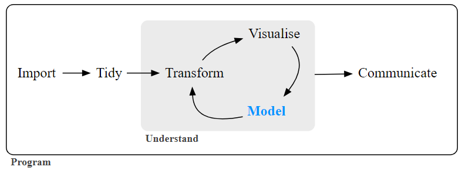

```{r, include=FALSE}
knitr::opts_chunk$set(echo = TRUE,
                      eval = TRUE,
                      error = FALSE,
                      message = FALSE,
                      warning = FALSE,
                      comment = NA)
```

# What is tidymodels?

Tidymodels is a collection of R packages and a framework for modeling and machine learning that follows the principles of tidy data and integrates seamlessly with the tidyverse ecosystem. It was developed to provide a consistent and organized way to perform machine learning tasks in R, making it easier for data scientists and analysts to build, evaluate, and deploy predictive models.

Install tidymodels with:
```{r, include = T}
# install.packages("tidymodels")
```

# Why tidymodels and not other R package?

Tidymodels offers several advantages that may make it a suitable choice for many data scientists and analysts. Here are some reasons why Tidymodels is often preferred:

* Tidyverse Integration: Tidymodels is built on the principles of the tidyverse, which promotes consistent and user-friendly data manipulation. If you are already familiar with the tidyverse, using Tidymodels can provide a seamless and consistent experience throughout your data analysis and modeling workflow.
* Consistency and Workflow: Tidymodels provides a structured workflow for modeling, including data pre-processing, model specification, tuning, and evaluation. This consistency can make your modeling process more organized and transparent.
* Recipes for Data Pre-processing: Tidymodels includes the recipes package, which allows you to specify data pre-processing steps in a structured and reproducible manner. This is particularly helpful for feature engineering and data transformation.
* Model Agnosticism: Tidymodels is model-agnostic, meaning it allows you to work with various modeling algorithms without significant changes to your code. You can easily swap out different models for experimentation and model selection.
* Hyperparameter Tuning: Tidymodels offers tools for hyperparameter tuning and model selection, making it easier to find the best combination of hyperparameters for your models.
* Resampling and Cross-Validation: The framework provides resampling methods for assessing model performance, such as cross-validation and bootstrapping, which are critical for estimating model generalization.
* Extensive Metrics: Tidymodels includes the yardstick package with a wide range of evaluation metrics for various types of models, making it easier to compare and assess model performance.
* Consistent API: The parsnip package provides a consistent interface for specifying and fitting models, regardless of the underlying modeling package. This can simplify the process of trying different models.
* Reproducibility and Documentation: Tidymodels emphasizes good practices for reproducibility, making it easier to document and share your modeling workflows with colleagues.
* Active Development: Tidymodels is actively maintained and updated, ensuring that it stays relevant and up-to-date with the latest developments in the field of machine learning.

# How does modeling fit into the data analysis process? 

According to Wickham and Grolemund (2016) the following figure illustrates the general data analysis process. Data ingestion and cleaning/tidying are shown as the initial steps. When the analytical steps for understanding commence, they are a heuristic process; we cannot pre-determine how long they may take. The cycle of transformation, modeling, and visualization often requires multiple iterations.

```{r, fig.align='center', echo=F, out.width = "90%"}
 
```
# Types of models

* Descriptive Models: these aim to summarize and describe data to gain insights into its characteristics. They are used for exploratory data analysis (EDA) and data visualization to understand the underlying patterns, relationships, and distributions in the data.Examples: Histograms, bar charts, scatter plots, summary statistics (mean, median, standard deviation), and data tables are common tools used for descriptive modeling.

* Inferential Models: these are used to draw conclusions or make inferences about a population based on a sample of data.They are employed in hypothesis testing and statistical analysis to determine whether observed effects are statistically significant and can be generalized to the larger population. Examples: T-tests, ANOVA, regression analysis, and chi-squared tests are commonly used inferential models.

* Predictive Models: these are designed to make predictions about future or unseen data based on patterns and relationships learned from historical data. They are used in forecasting, classification, and regression tasks, and are valuable in applications such as weather forecasting, customer churn prediction, and stock price forecasting.
Examples: Linear regression, decision trees, random forests, neural networks, and support vector machines are popular predictive modeling techniques.

In summary, descriptive models help summarize and visualize data, inferential models draw conclusions about populations, and predictive models make future predictions based on historical data. The choice of model depends on your specific goals and the type of analysis you need to perform, whether it's for understanding data, drawing statistical inferences, or making predictions for decision-making.

# Some functions of tidymodels

* broom: takes the messy output of built-in functions in R, such as lm, nls, or t.test, and turns them into tidy data frames.
* dials: has tools to create and manage values of tuning parameters. 
* dplyr: contains a grammar for data manipulation. 
* ggplot2: implements a grammar of graphics. 
* infer: is a modern approach to statistical inference. 
* parsnip: is a tidy, unified interface to creating models. 
* purrr: is a functional programming toolkit. 
* recipe: is a general data preprocessor with a modern interface. It can create model matrices that incorporate feature engineering, imputation, and other help tools. 
* rsample: has infrastructure for resampling data so that models can be assessed and empirically validated.
* tibble: has a modern re-imagining of the data frame. 
* tune: contains the functions to optimize model hyper-parameters. 
* workflows: has methods to combine pre-processing steps and models into a single object. 
* yardstick: contains tools for evaluating models (e.g.accuracy, RMSE, etc.). 

A list of all tidymodels functions across different CRAN packages can be found at https://www.tidymodels.org/find/ 

# Tidymodels workflow 

a. Pre-processing
Pre-processing involves preparing the data for modeling. This includes tasks such as data splitting, feature engineering, and data transformation. Some useful steps include:
* Data splitting with rsample: Use rsample to split your dataset into training, validation, and test sets. This is crucial for assessing and tuning your models.
* Feature engineering with recipes: Create a recipe that specifies how to pre-process your data, including steps like data normalization, one-hot encoding, and handling missing values.

b. Modelling
The modeling stage involves building and tuning machine learning models using a consistent and user-friendly interface.
Some useful steps include:
* Model specification with parsnip: Use parsnip to specify the type of model and its hyperparameters.
* Model fitting with workflows: Create a workflow that combines data pre-processing (from the recipe) and model specification. Fit the workflow to your training data.
* Tuning with tune: Utilize tune to perform hyperparameter tuning, search for the best model configuration, and optimize model performance.
* Evaluation with broom: Use broom to tidy up model results, making them easier to interpret and visualize.

c. Post-processing
Post-processing involves evaluating the model's performance, selecting the best model configuration, and fine-tuning hyperparameters. Some useful steps include:
* Model Evaluation with yardstick: Use yardstick to calculate evaluation metrics like RMSE, MAE, or ROC AUC.
* Hyperparameter Tuning with tune and dials: Fine-tune model hyperparameters to optimize performance based on evaluation metrics.

# Example
Now we are going to do a practical exercise to show how to use the tidymodels package:

Define the libraries to use: (PLEASE ADD ALL OF THEM HERE!)
```{r, include = T}
# install.packages("kmed")
library(tidymodels)
library(dplyr)
library(ggplot2)
library(rsample)
library(recipes)
library(parsnip)
library(workflows)
library(tune)
library(broom)
library(yardstick)
library(tune)
library(dials)
library(lubridate)
library(kmed)
```

Load the dataset and view the first rows. In this case we will use the dataset heart from the kmed package which contains 14 variables of 297 patients for their heart disease diagnosis. Metadata can be found in: https://search.r-project.org/CRAN/refmans/kmed/html/heart.html
```{r}
library("kmed")
data <- heart
head(data)
```

Check summary statistics of the dataset
```{r}
summary(data)
```

integrate this in recipe:
```{r}
# create variable of heart disease
data <- data %>%
  mutate(heart_disease = ifelse(class %in% c(1, 2, 3, 4), 1, 0))

data$heart_disease <- as.factor(data$heart_disease)
data$sex <- as.factor(data$sex)
data$fbs <- as.factor(data$fbs)

# create categorical variable for age
data <- data %>%
  mutate(age_group = case_when(
    age < 40 ~ "Young adult",
    age >= 40 & age < 60 ~ "Adult",
    age >= 60 ~ "Senior"
  ))

data$age_group <- as.factor(data$age_group)


```

```{r}
#Ensure the response variable is a factor for classification tasks
data$class <- as.factor(data$class)
```

```{r}
# Split the data into training (75%) and testing (25%) sets
set.seed(123) # for reproducibility
data_split <- initial_split(data, prop = 0.75)
train_data <- training(data_split)
test_data  <- testing(data_split)
```

```{r}
# Set up the enhanced recipe for preprocessing
recipe <- recipe(class ~ ., data = train_data) %>% 
  step_impute_median(all_numeric(), -all_outcomes()) %>% 
  step_unknown(all_nominal(), -all_outcomes()) %>%
  step_dummy(all_nominal(), -all_outcomes()) %>%
  step_zv(all_predictors()) %>%
  step_normalize(all_numeric(), -all_outcomes()) %>%
  prep()
```

```{r}
# Process the training and testing sets with the recipe
train_processed <- bake(recipe, new_data = train_data)
test_processed  <- bake(recipe, new_data = test_data)
```

```{r}
#Creating a workflow 

lm_spec <- linear_reg() %>%
  set_engine("glm")

wflow <- workflow() %>% 
  add_recipe(recipe) %>%
  add_model(glm_spec)

```
```{r}

```


Create different models for the dependent variable "heart disease":
```{r}
# create linear regression models

# model 1
model_1 <- glm(heart_disease == 1 ~ age + sex + trestbps + chol + fbs + thalach, data = data, family = binomial)
summary(model_1)

# model 2
model_2 <- glm(heart_disease ==1  ~ age + sex + trestbps + chol + fbs + thalach + sex*age_group, data = data, family = binomial)
summary(model_2)

# model 3
```


Confidence interval for the coefficient
```{r}
confint(model)
```

Let's create a scatterplot to visualize the relationship between mpg and horsepower.
```{r}
ggplot(data, aes(x = age, y = heart_disease)) +
  geom_point() +
  geom_smooth(method = "lm", se = FALSE, color = "blue") +
  labs(title = "-", x = "Age", y = "Heart Disease")
```

Anova table for the model
```{r}
anova(lm_model)

```


